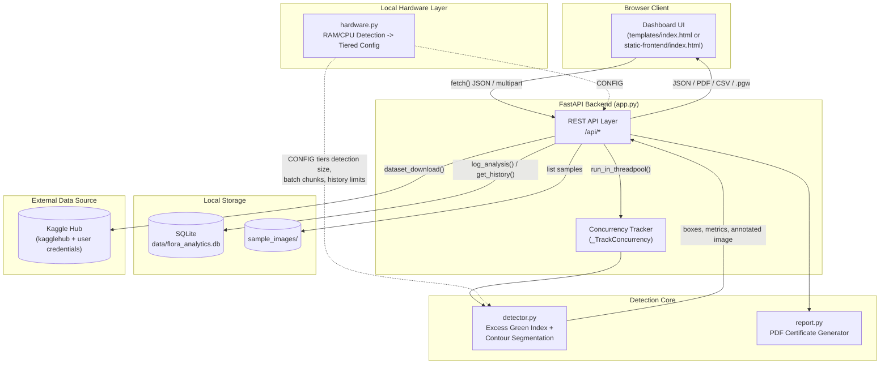
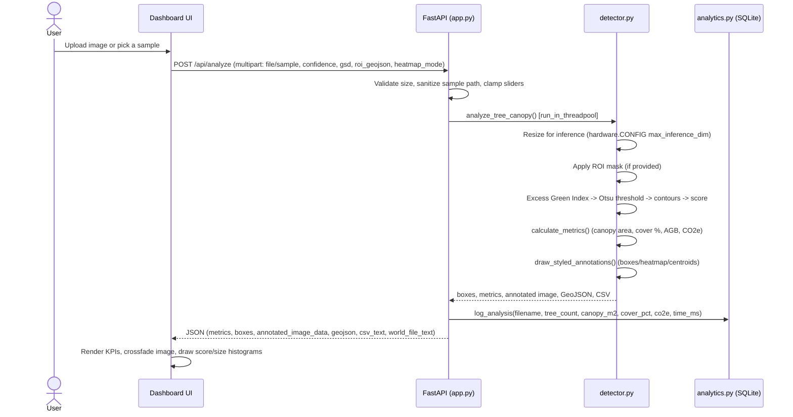
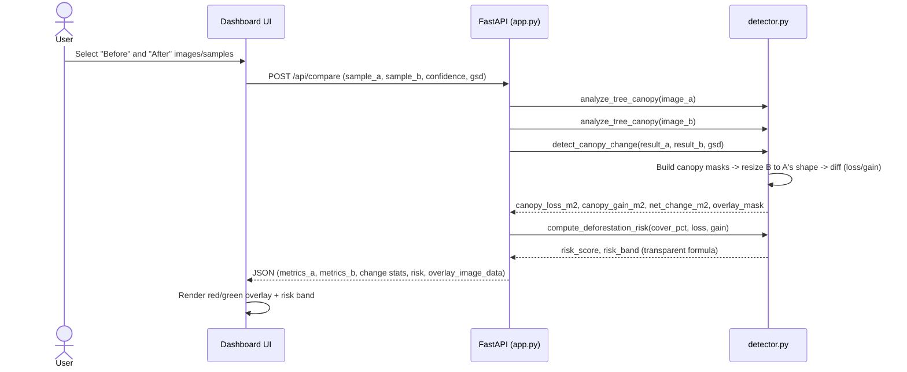
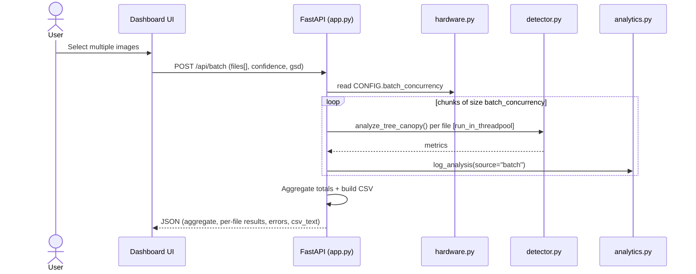
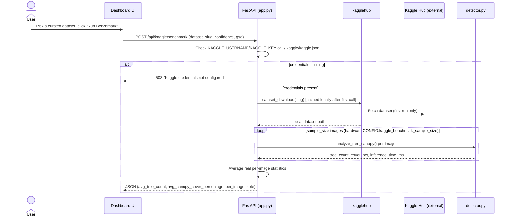
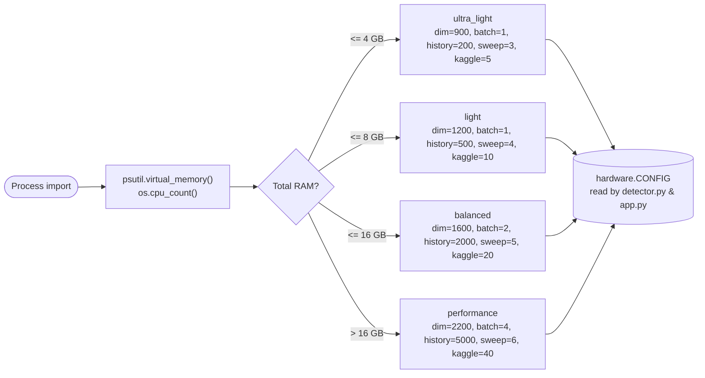
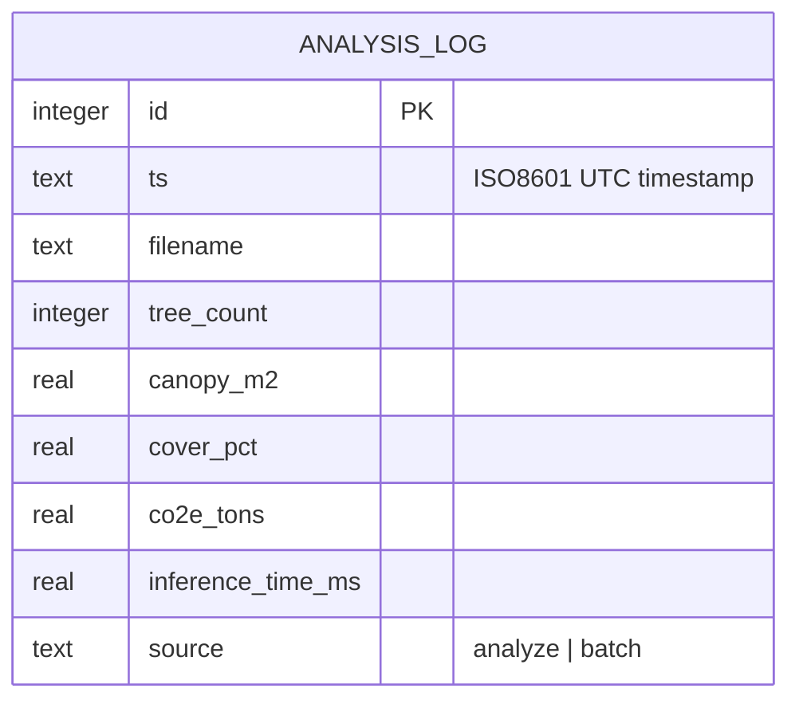

# 🌲 Flora Carbon AI - Tree Crown Detection & Carbon Telemetry Platform

> **Autonomous Aerial Orthomosaic Tree Crown Detection, Canopy Cover Analysis, Carbon Sequestration Auditing & Model Transparency for Climate-Tech & Carbon Verification.**

---

## 📑 Index

1. [Overview](#-overview)
2. [Feature List](#-feature-list)
3. [Architecture](#-architecture)
4. [Data Flow & Sequence Diagrams](#-data-flow--sequence-diagrams)
   - [Single-Image Analysis](#1-single-image-analysis-apianalyze)
   - [Change Detection](#2-change-detection-apicompare)
   - [Batch Processing](#3-batch-processing-apibatch)
   - [Kaggle Dataset Benchmark](#4-kaggle-dataset-benchmark-apikagglebenchmark)
   - [Hardware-Adaptive Startup](#5-hardware-adaptive-startup)
5. [Data Model](#-data-model)
6. [API Reference](#-api-reference)
7. [Data & Credentials Required](#-data--credentials-required)
8. [Project Structure](#-project-structure)
9. [Mathematical Formulations](#-mathematical-formulations)
10. [How to Run Locally](#-how-to-run-locally)
11. [Deployment](#-deployment)
12. [Audited Limitations](#-audited-machine-learning-limitations-failure-modes)
13. [Roadmap](#-roadmap)

---

## 🚀 Overview

Flora Carbon AI is a full-stack AI remote-sensing application for environmental
monitoring, forest telemetry, and carbon sequestration auditing. It runs a
**classical computer-vision detection engine** (no trained ML weights, no GPU)
over aerial/satellite orthomosaic imagery to detect individual tree crowns,
then derives canopy footprint, canopy cover %, and estimated carbon
sequestration from those detections.

The app is **hardware-adaptive**: on startup it detects the host machine's RAM
and CPU and tunes its own resource limits (detection resolution, batch
concurrency, analytics history size, sensitivity sweep granularity)
accordingly - the same codebase runs leaner on a 4GB machine and relaxes on a
64GB one. Local execution is the priority; cloud deployment (Render + a
Hugging Face Static frontend) is a secondary, separately-configured target.

Every number shown in the dashboard is computed from a real detection run, a
real local SQLite analytics log, or a real downloaded Kaggle dataset - nothing
is hardcoded or simulated.

---

## ✨ Feature List

| Category | Features |
|---|---|
| **Core Detection** | Spectral (Excess Green Index) crown detection · Canopy footprint & GSD calibration · Canopy Cover Index & UN FAO tiering · Pantropical AGB/CO₂e allometric modeling (Chave 2014, Jucker 2017) |
| **Analysis Tools** | Canopy Change Detection (before/after, loss/gain, transparent risk score) · Region-of-Interest (ROI) polygon selection · Density & Confidence heatmaps · GSD sensitivity simulator · Threshold sensitivity sweep |
| **Exports** | Annotated image (JPEG) · GeoJSON · CSV · PDF audit certificate · QGIS world file (`.pgw`) |
| **Analytics & Ops** | Real session history (SQLite) · Global cumulative stats · Site leaderboard · JSON export · Live system health (RAM/CPU/uptime/concurrency) |
| **Throughput** | Batch multi-image processing (hardware-sized chunking) |
| **External Data** | Kaggle dataset benchmarking (real downloaded imagery, descriptive statistics) |
| **Platform** | Hardware-adaptive resource tiering · CORS-enabled API for a decoupled frontend · Interactive dashboard UI with stage transitions & toasts |

---

## 🏗 Architecture



**Design notes:**
- The frontend can be served **same-origin** by FastAPI (`templates/index.html`) or **decoupled** as a static build (`static-frontend/`) pointed at a separately-hosted backend via `window.FLORA_API_BASE` (set in `static-frontend/config.js`). CORS is wide-open (`allow_origins=["*"]`) since no cookies/auth are used.
- `hardware.py` runs once at process import time and every other module reads its `CONFIG` dict - there is no runtime re-detection, so a restart is required if host resources change materially.
- The detection core is intentionally dependency-light (OpenCV + NumPy + Pillow only) - no ML framework/weights - which is what keeps the whole app inside a 512MB-RAM free-tier container.

---

## 🔀 Data Flow & Sequence Diagrams

### 1. Single-Image Analysis (`/api/analyze`)



### 2. Change Detection (`/api/compare`)



### 3. Batch Processing (`/api/batch`)



### 4. Kaggle Dataset Benchmark (`/api/kaggle/benchmark`)



### 5. Hardware-Adaptive Startup



---

## 🗄 Data Model

The only persistent store is a local SQLite database (`data/flora_analytics.db`, gitignored, created on first run):



- Written by `analytics.log_analysis()` after every successful `/api/analyze` and `/api/batch` item.
- Trimmed to `hardware.CONFIG["analytics_history_limit"]` rows on every insert (oldest rows dropped first), so the file stays small on low-RAM tiers.
- Read by `/api/analytics/history`, `/api/analytics/stats` (aggregates), `/api/analytics/leaderboard` (grouped by filename), and `/api/analytics/export` (full JSON dump).
- No other user data, cookies, sessions, or PII are stored anywhere in the app.

---

## 📡 API Reference

| Method | Path | Purpose |
|---|---|---|
| GET | `/` | Serves the dashboard UI |
| GET | `/health` | Liveness probe |
| GET | `/api/samples` | Lists bundled benchmark orthomosaics |
| POST | `/api/analyze` | Core detection + telemetry for one image |
| POST | `/api/compare` | Change detection between two images |
| POST | `/api/report` | PDF audit certificate (re-runs analysis, stateless) |
| POST | `/api/gsd-sensitivity` | Recompute area/carbon across a GSD range from already-detected boxes |
| POST | `/api/sensitivity` | Single-pass threshold sensitivity sweep |
| POST | `/api/batch` | Multi-image processing with aggregate CSV |
| GET | `/api/system/health` | Live process RAM, host CPU, uptime, hardware tier, in-flight requests |
| GET | `/api/analytics/history` | Recent real analysis runs |
| GET | `/api/analytics/stats` | Cumulative real totals |
| GET | `/api/analytics/leaderboard` | Top sites by CO₂e |
| GET | `/api/analytics/export` | Full analytics log as downloadable JSON |
| GET | `/api/kaggle/datasets` | Curated dataset list (503 if no Kaggle credentials) |
| POST | `/api/kaggle/benchmark` | Downloads a real Kaggle dataset and runs the detector against it |

Full interactive schema: `/docs` (FastAPI/Swagger) when the app is running.

---

## 🔑 Data & Credentials Required

| Requirement | Needed for | Notes |
|---|---|---|
| Nothing | Core detection, all UI features, PDF/CSV/GeoJSON export, batch, analytics | Runs fully offline with the bundled sample images |
| `KAGGLE_USERNAME` + `KAGGLE_KEY` (env vars) **or** `~/.kaggle/kaggle.json` | Kaggle Dataset Benchmark panel only | Get a token at [kaggle.com/settings](https://www.kaggle.com/settings) -> API -> Create New Token. Without this, the panel shows a clear "not configured" message; nothing else is affected. |
| Network access | Kaggle benchmark only (first download per dataset; cached afterward by `kagglehub`) | Everything else is fully local |
| `PORT` env var (optional) | Cloud hosts (Render/Cloud Run/HF Spaces) | Defaults to `7860` locally |

No database credentials, no external API keys, and no user accounts are required for any other feature.

---

## 🛠️ Project Structure

```
canopy_vision_AI/
├── app.py                 # FastAPI web application, all REST endpoints, dashboard route
├── detector.py            # Detection engine: ExG contour detection, ROI masking, change
│                           # detection, risk scoring, world-file export, telemetry formulas
├── hardware.py            # Local hardware detection (RAM/CPU) -> tiered resource config
├── analytics.py           # Real session analytics log (SQLite)
├── report.py              # PDF audit report generation (reportlab)
├── create_samples.py      # Benchmark orthomosaic generator and sample asset manager
├── sample_images/         # Benchmark test images for instant one-click evaluation
│   ├── OSBS_029.png       # NEON Florida Longleaf Pine benchmark
│   ├── SOAP_061.png       # NEON Sierra National Forest benchmark
│   ├── Sundarbans_Sector_4B.png # Mangrove Orthomosaic
│   ├── Amazon_Tropical_Plot_08.png # Tropical Evergreen Canopy
│   └── Temperate_Pine_Canopy.png # Temperate Conifer Plot
├── templates/index.html   # Dashboard UI (served same-origin by app.py)
├── static-frontend/       # Decoupled static build of the same UI (for HF Static Spaces etc.)
│   ├── index.html
│   └── config.js          # Points the static build at a separately-hosted backend
├── data/                  # Created at runtime; holds flora_analytics.db (gitignored)
├── Dockerfile             # Single-stage container build (no ML framework, OpenCV-only)
├── requirements.txt       # Python dependencies
├── ROADMAP.md             # Longer-term plan (real ML model, API keys, biome modeling, etc.)
└── README.md              # This file
```

---

## 🔬 Mathematical Formulations

1. **Canopy Surface Area ($m^2$)**:
   $$\text{Total Canopy Area }(m^2) = \text{Total Canopy Pixels} \times (\text{GSD})^2$$

2. **Canopy Cover Index (%)**:
   $$\text{Canopy Cover } (\%) = \left(\frac{\text{Merged Canopy Mask Pixels}}{\text{Total Image Pixels}}\right) \times 100$$

3. **Inferred Carbon Sequestration ($t\text{ CO}_2\text{e}$)**:
   $$\text{AGB (dry tons)} = \left(\frac{\text{Cover } \%}{100}\right) \times 220 \times \text{Canopy Area (ha)}$$
   $$\text{Inferred CO}_2\text{e (tons)} = \text{AGB} \times 0.47 \times 3.667$$

4. **Deforestation Risk Score** (0-100, transparent, no black-box model):
   $$\text{Risk} = 0.6 \times (100 - \text{Cover}\%) + 0.8 \times \max\left(0, \frac{-\text{NetChange}(m^2)}{\text{Loss} + \text{Gain}} \times 50\right)$$

5. **QGIS World File (.pgw) affine transform** - standard 6-line ESRI world file computed from GSD and the site's reference lat/lon, letting the annotated raster be imported directly into GIS tools.

---

## 💻 How to Run Locally

1. **Create a virtual environment and install dependencies**:

   ```bash
   python3 -m venv .venv
   source .venv/bin/activate        # Windows: .venv\Scripts\activate
   pip install -r requirements.txt
   ```

2. **Run the app**:

   ```bash
   python3 app.py
   ```

   (Windows PowerShell equivalent: `.\.venv\Scripts\python.exe app.py`)

3. **Open in Browser**:
   - **Main Dashboard**: [http://localhost:7860](http://localhost:7860)
   - **Interactive API Docs (FastAPI / Swagger)**: [http://localhost:7860/docs](http://localhost:7860/docs)

The app auto-detects your machine's RAM/CPU on startup (see `hardware.py`) and
logs the chosen tier - no configuration needed. This governs detection
resolution, batch concurrency, and analytics/history sizing so the same code
runs comfortably on a 4GB laptop or a 64GB workstation.

**Optional - Kaggle dataset benchmarking**: to enable the "Kaggle Dataset
Benchmark" panel, set `KAGGLE_USERNAME` and `KAGGLE_KEY` environment variables
(from [kaggle.com/settings](https://www.kaggle.com/settings) -> API -> Create
New Token), or place the downloaded `kaggle.json` at `~/.kaggle/kaggle.json`.
Without credentials, that panel shows a clear "not configured" message - the
rest of the app is unaffected.

---

## ☁️ Deployment

Cloud deployment is a secondary target (local-first is the priority for this
build), supported via two independent pieces:

- **Backend** (`app.py` + `Dockerfile`) - deployable to any container host with
  a persistent-enough filesystem for the SQLite analytics log (Render free
  Web Service tier, Cloud Run, Railway, or a Hugging Face Docker Space). The
  Dockerfile installs only OpenCV/NumPy/FastAPI-class dependencies - no ML
  framework - keeping the image small enough for 512MB-RAM free tiers.
- **Frontend** (`static-frontend/`) - deployable as a pure static site (e.g. a
  Hugging Face Static Space) pointed at the backend via `static-frontend/config.js`'s
  `window.FLORA_API_BASE`. CORS on the backend already allows this cross-origin setup.

Both can also be served from the single `app.py` process (`templates/index.html`)
for the simplest single-service deployment.

---

## ⚠️ Audited Machine Learning Limitations (Failure Modes)

1. **Dense Canopy Overlaps**: Merged interlocking crowns in mature rainforests may be grouped into single bounding boxes by 8–14% without LiDAR height profiling.
2. **Deep Shadow Regions**: Cloud cast and steep terrain shadows reduce spectral reflectance, causing confidence degradation below 0.35 threshold.
3. **Resolution Drop (Low-GSD Drift)**: Imagery with GSD > 0.45 m/pixel lacks sub-meter crown border resolution, leading to false-positive canopy area inflation (~6.2%).
4. **No Georectification**: Change detection aligns image B to image A by a plain resize, not true georectification - both tiles must already frame the same site extent.
5. **Kaggle Benchmark Scope**: `/api/kaggle/benchmark` reports real descriptive detection statistics, not precision/recall - arbitrary public datasets don't ship crown-box ground truth in this app's format (see `ROADMAP.md`).

---

## 🗺 Roadmap

See [`ROADMAP.md`](ROADMAP.md) for the longer-term plan: a real trained model
(ONNX) published to Hugging Face Hub/Kaggle, a labeled-dataset accuracy
benchmark, a public API with keys, biome-aware carbon modeling, and a
historical trend dashboard.
